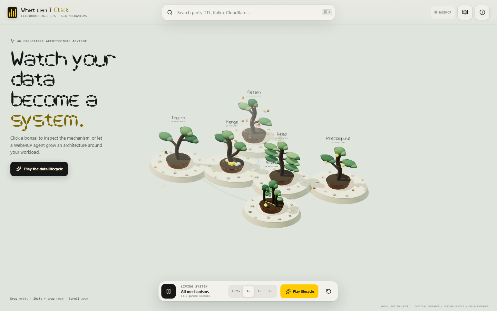

# What can I Click

An explorable ClickHouse architecture advisor rendered as a living bonsai world.



The product has two acts: a WebMCP agent turns a bounded workload profile into an evidence-backed architecture path, then the browser animates that path across six inspectable ClickHouse mechanisms. Without WebMCP, the same content remains searchable, clickable, keyboard-accessible, and available as a text atlas.

## The six mechanisms

- Ingestion, batching, asynchronous inserts, and ClickPipes
- MergeTree parts and background merges
- Sparse primary indexes, granules, and query pipelines
- Materialized views and projections
- Shards, replicas, and ClickHouse Keeper
- TTL, mutations, and backups

Motion is explanatory rather than benchmark timing. Beetles gather batches, roots merge parts, fireflies skip indexed branches, hummingbirds visit prepared aggregates, replica trunks share glowing roots, and TTL drops aging leaves.

## WebMCP tools

- `describe_clickhouse_world`
- `recommend_clickhouse_architecture`
- `play_architecture_story`
- `inspect_clickhouse_mechanism`
- `compare_clickhouse_methods`
- `search_clickhouse_evidence`
- `reset_clickhouse_world`

The advisor accepts only enumerated workload characteristics. It rejects additional fields, credentials, raw schemas, arbitrary SQL, executable content, and secrets. Recommendations are deterministic and identify official, derived, and field evidence separately.

## Run locally

```bash
bun install
bun run dev
```

Quality gates:

```bash
bun run check
bun run test:e2e
```

The app is static and deploys to Cloudflare Pages with `bun run deploy`.

## Evidence policy

Claims are scoped to ClickHouse 26.3 LTS. Official documentation and the official ClickHouse agent skills outrank field stories. The included company corpus is manually reviewed and bounded to ten representative public stories. A company version is shown only when explicitly disclosed; otherwise the UI says “Not disclosed.”

## Trademark

ClickHouse and its logo are trademarks of ClickHouse, Inc. The official logomark is displayed unmodified in the attribution panel. This independent educational project is not endorsed by or affiliated with ClickHouse, Inc.
